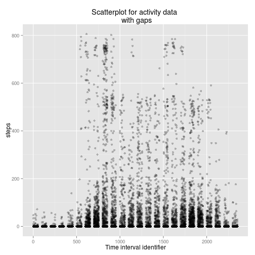
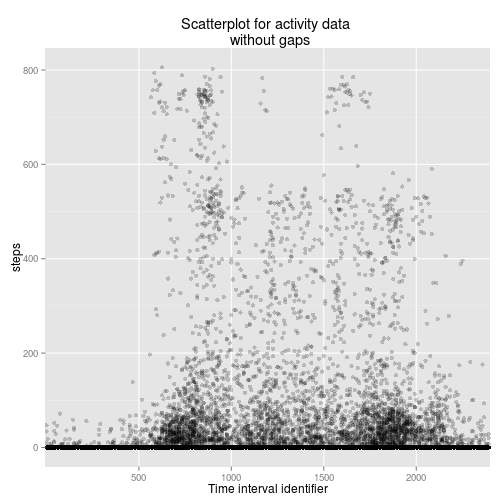
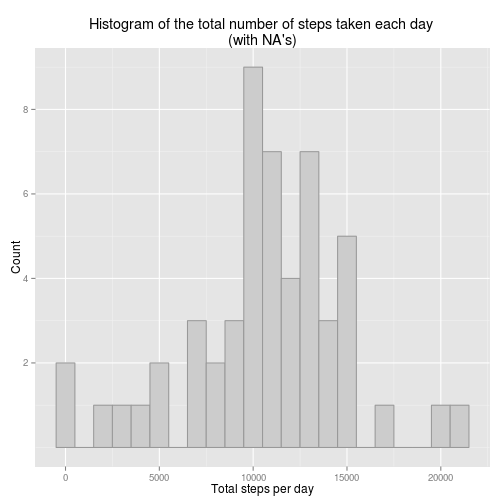
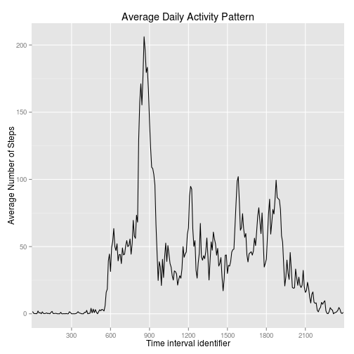
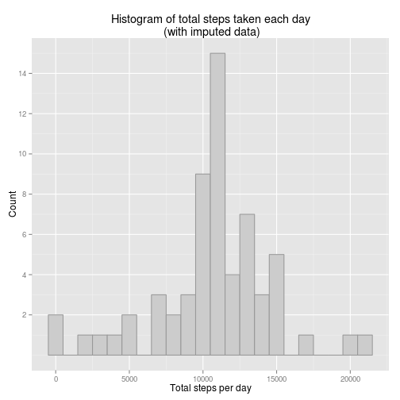
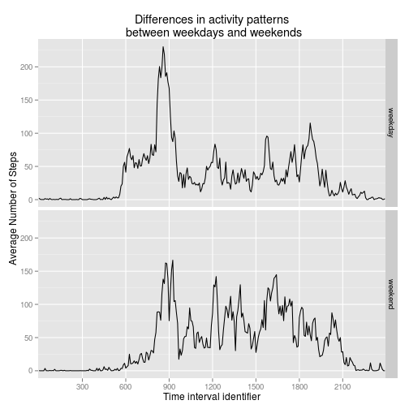

```r
options(scipen = 1, digits = 2)
```

# Reproducible Research: Peer Assessment 1

This is an analysis of two month worth data of number of steps taken by an 
individual and recorded throughout a day in 5 minute intervals.

The raw data are in the zipped `csv` file containing 17,568 observations 
recorded in three columns:

1. **steps**: Number of steps taken in a 5-minute interval 
(missing values are coded as NA)

2. **date**: The date on which the measurement was 
taken in YYYY-MM-DD format

3. **interval**: Identifier for the 5-minute interval 
in which measurement was taken


## Loading and preprocessing the data

First load the data stored in `activity.zip` into R via `read.csv`.

To read data properly I explicitly specify class of the `date` column as `"Date"` via `colClasses = ` parameter: 


```r
activity <- read.csv(unz("activity.zip", "activity.csv"),
                     colClasses = c("date" = "Date"),
                     header = T)
```

As a result, I have `activity` object of `"data.frame"` class, with column classes:


```r
sapply(activity, class)
```

```
##     steps      date  interval 
## "integer"    "Date" "integer"
```

Now `interval` column, which is of `"integer"` class, has breaks after 12th interval
each hour, e.g. see pattern around 1 AM:


```r
activity[10:14,]
```

```
##    steps       date interval
## 10    NA 2012-10-01       45
## 11    NA 2012-10-01       50
## 12    NA 2012-10-01       55
## 13    NA 2012-10-01      100
## 14    NA 2012-10-01      105
```

If left "as is", the data set will result in graphs with artifactual gaps 
before beginning of each new hour:


```r
require(ggplot2)
ggplot(data=activity, aes(x=interval, y=steps)) +
        geom_point(alpha=.25) + # account for overplotting
        labs(title = "Scatterplot for activity data \n with gaps",
             x="Time interval identifier")
```

 

One of the possible ways to cure this problem is to convert `interval` 
column to `"factor"` class, while **explicitly setting the order** of factor levels:


```r
lev <- as.character(seq(0,2355,5))
activity$interval <- factor(activity$interval, levels = lev)
activity <- droplevels(activity)
```

Now the artifacts disappear:


```r
ggplot(data=activity, aes(x=interval, y=steps)) +
        geom_point(alpha =.2) +
        scale_x_discrete(breaks = as.character(seq(500,2500,500))) +
        labs(title = "Scatterplot for activity data \n without gaps",
             x="Time interval identifier")
```

 

Now that I have tidy preprocessed data set `activity` I can proceed to further analysis.

## What is mean total number of steps taken per day?

Throughout the rest of the analysis I use `plyr` and `ggplot2` packages 
by Hadley Wickham. `Plyr` package is a friendly substitute to base 
R's "apply" family of functions, which is built with "split, apply, combine" 
workflow philosophy in mind. `ggplot2` is Hadley's R implementation 
of grammar of graphics from Wilkinson. Both packages can be installed from CRAN.


```r
require(plyr)
require(ggplot2)
```

Drawing histogram distribution of total steps per day takes two steps:

1. Calculate a new data frame object `total.steps` with two columns: 
`date` and `total.steps.day`. This is done with the help of `ddply` 
function from `plyr` package:


```r
total.steps <- ddply(activity, 
                     "date", 
                     summarize, 
                     tot.steps.day = sum(steps, na.omit = T))
```

The meaning of the parameters is as follows:

* `activity` - variable of `"data.frame"` class (df) to summarize  
* `"date"` - variable over unique values of which df will be split  
* `summarize` - type of function to apply to split parts of df  
* `tot.steps.day` - summary variable to calculate on split df 

2. Plot histogram of total steps per day with the help of `ggplot2` package 
while adjusting some default parameters:


```r
ggplot(data = total.steps, aes(x=tot.steps.day)) +
        geom_histogram(col="grey60",
                       fill = "grey80",
                       binwidth = 1000,
                       origin = -500) +
        scale_y_continuous(breaks = seq(2,10,2)) +
        labs(title = "Histogram of the total number of steps taken each day \n(with NA's)",
             x = "Total steps per day",
             y = "Count")
```

 

Two days that are counted in "0" bin are actually days with 127 and 42 steps. Days
with missing values (`NA`) are **ignored** (not counted as 0).

Mean of total steps per day is calculated as follows:


```r
mean.steps <- mean(total.steps$tot.steps.day, na.rm=T)
mean.steps
```

```
## [1] 10767
```

Thus the mean number of total steps per day is 10767.19

Median of total steps per day is calculated as follows:


```r
median.steps <- median(total.steps$tot.steps.day, na.rm=T)
median.steps
```

```
## [1] 10766
```

Thus the median number of total steps per day is 10766


## What is the average daily activity pattern?

To make a line plot of steps taken per interval averaged over two month period 
I first have to calculate `activity.pattern` object of class `"data.frame"` 
consisting of two columns: interval and average number of steps per interval. 
With the help of plyr:


```r
activity.average <- ddply(activity,
                          "interval",
                          summarize,
                          avg.steps = mean(steps, na.rm=T))
```

Then, make a plot of mean steps per interval:


```r
ggplot(data=activity.average) +
        geom_line(aes(x=interval, y = avg.steps, group=1)) +
        scale_x_discrete(breaks = as.character(seq(300,2400,300))) +
        labs(title="Average Daily Activity Pattern",
             x="Time interval identifier",
             y="Average Number of Steps")
```

 

Calculate which 5-minute interval, on average across all the days in the dataset, 
contains the maximum number of steps?


```r
n <- which.max(activity.average$avg.steps)
activity.average[n, ]
```

```
##     interval avg.steps
## 104      835       206
```

Interval on average containing maximum number of steps 
is 835

## Imputing missing values

Calculate total number of rows with missing data:


```r
na.vector <- is.na(activity$steps)
mis.rows <- sum(na.vector)
mis.rows
```

```
## [1] 2304
```

Thus the number of rows with missing data is 2304


The strategy for imputing missing data:
* substitute missing data by average of existing records over the same
time interval

To do so, I first create a df of the same # of rows as original activity dataset
with additional column representing averages over interval


```r
impute <- ddply(activity,
                "interval",
                transform,
                avg.steps = mean(steps, na.rm=T))
# rearrange df first by date second by interval
impute <- arrange(impute, date, interval)
```

And then I loop through the copy of original df and substitute missing values 
by calculated averages


```r
activity.imputed <- activity
activity.imputed$steps <- ifelse(na.vector,
                                 impute$avg.steps,
                                 activity$steps)
```

To make a histogram with imputed data I need to calculte a new `"data.frame"` 
containing columns for date and total number of steps per date:


```r
total.steps.imputed <- ddply(activity.imputed,
                             "date",
                             summarize,
                             total.steps=sum(steps))
```

Plotting a histogram with imputed data:


```r
ggplot(data=total.steps.imputed, aes(x=total.steps)) +
        geom_histogram(col="grey60",
                       fill = "grey80",
                       binwidth = 1000,
                       origin = -500) +
        scale_y_continuous(breaks = seq(2,16,2)) +
        labs(title = "Histogram of total steps taken each day\n (with imputed data)",
             x = "Total steps per day",
             y = "Count")
```

 

Calculating mean of imputed activity data:


```r
mean.steps.imp <- mean(total.steps.imputed$total.steps)
mean.steps.imp
```

```
## [1] 10766
```

Thus, mean total number of steps per day with imputed data is 10766.19

Calculating median of imputed activity data:


```r
median.steps.imp <- median(total.steps.imputed$total.steps)
median.steps.imp
```

```
## [1] 10766
```

Thus, median total number of steps per day with imputed data is 10766.19

Mean and median from imputed data varies very little from those of original data:


```r
mean.var <- mean.steps.imp - mean.steps
mean.var
```

```
## [1] -1
```

```r
median.var <- median.steps.imp - median.steps
median.var
```

```
## [1] 0.19
```

To test if the change in means statistically significan let's perform 
a t-test for difference in means


```r
t.test(total.steps.imputed$total.steps, total.steps$tot.steps.day)
```

```
## 
## 	Welch Two Sample t-test
## 
## data:  total.steps.imputed$total.steps and total.steps$tot.steps.day
## t = -0.0013, df = 107, p-value = 0.999
## alternative hypothesis: true difference in means is not equal to 0
## 95 percent confidence interval:
##  -1540  1538
## sample estimates:
## mean of x mean of y 
##     10766     10767
```

The results of the test tells us that given the amount of data, imputation of
missing values does not significantly change mean of the sample.

However, the main effect of imputing missing data becomes apparent not after 
comparign means, but after comparing the shape of the distributions:  

1. The peak of the histogram distribution slightly shifts to the right
2. The peak becomes more pronounced and the shape of the disttibution slightly changes.


## Are there differences in activity patterns between weekdays and weekends?

Create a new factor variable in the dataset with two levels – “weekday” and “weekend”
indicating whether a given date is a weekday or weekend day.


```r
activity.imputed$day <- ifelse(weekdays(activity.imputed$date) == "Saturday" |
                               weekdays(activity.imputed$date) ==  "Sunday",
                               "weekend",
                               "weekday")
activity.imputed$day <- factor(activity.imputed$day, levels = c("weekday", "weekend"))
```

Before we can plot, we have first to aggregate data within each categorical
variable of interest:

```r
activity.imputed.average <- ddply(activity.imputed,
                                  c("interval", "day"),
                                  summarize,
                                  avg.steps = mean(steps))
```

Make a panel plot containing a time series plot (i.e. `type = "l"` ) 
of the 5-minute interval (x-axis) and the average number of steps taken, 
averaged across all weekday days or weekend days (y-axis).


```r
ggplot(data=activity.imputed.average) +
        geom_line(aes(x=interval, y=avg.steps, group=day))  +
        facet_grid(day~.) +
        scale_x_discrete(breaks = as.character(seq(300,2400,300))) +
        labs(title="Differences in activity patterns\n between weekdays and weekends",
             x="Time interval identifier",
             y="Average Number of Steps")
```

 

Differences in activity patterns between weekdays and weekends:

1. On average, weekend activity is more evenly distributed from 9 AM to 21 PM
whereas weekday activities have a peculiar spike before 9AM that dominates
the distribution.
2. Weekend activities around 6-8 AM are significantly lower on average than
those of weekdays

## Remarks

1. There are different roots to address 55-100 "gaps" in the original time 
interval data. Choosing between explicitly converting identifiers to `"factor"` 
or object of `"POSIXt"` class I discarded the latter because it will coerce 
time intervals to a type of DateTime object, that will have dates int it 
(neither dates nor tz are in the original data!!!) A meaningful root to me 
could have been to combine Date and Time interval in one variable 
of class `"POSIXt"` just after reading data.

2. Besides `ddply` function from `plyr` package, `aggregate()` could be applied 
to perform data aggregation

3. When plotting time interval data, prettifying axis labels with `scales` 
package by Hadley Wickham is possible, but was not applied to leave data 
as close to originals as possible.
